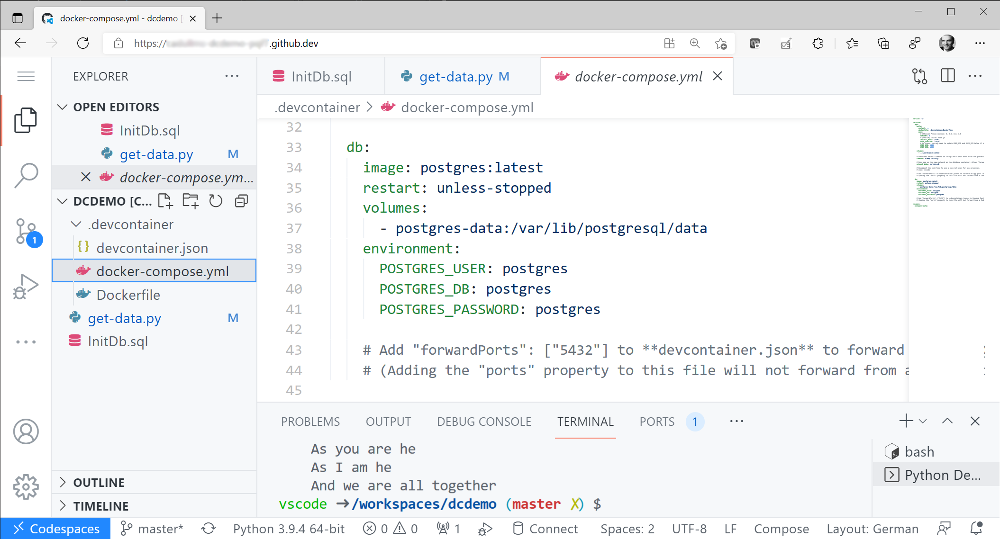
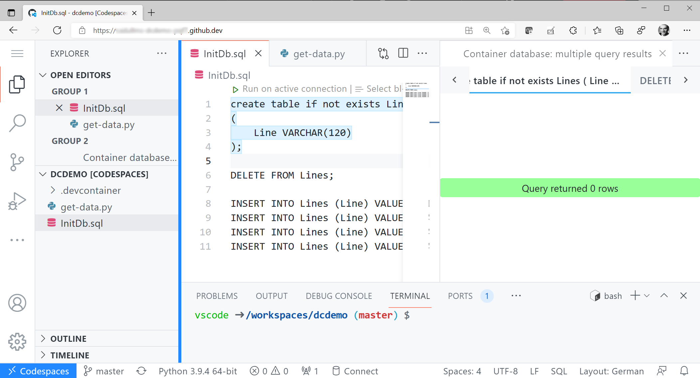
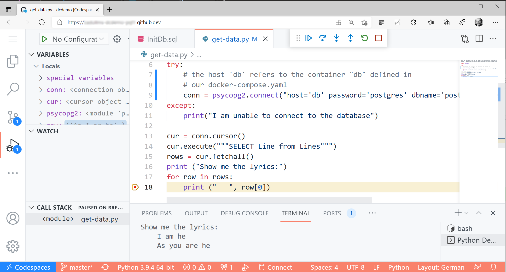

# Quick Demo for Remote Containers

This is my personal demo repo for demonstrating something that is a bit more complex than hello-world (i.e. a multi container setup), but still easy to grasp.

## Dev Tooling Used
- [VS Code](https://code.visualstudio.com/)
- [VS Code Remote Containers](https://code.visualstudio.com/docs/remote/containers)
- [Docker Desktop on WSL 2](https://docs.docker.com/docker-for-windows/wsl)
- [GitHub CodeSpaces](https://github.com/features/codespaces)

## Sample Tech
- [Python 3](https://www.python.org/)
- [Postgres](https://www.postgresql.org/)
- [psycopg2 library](https://wiki.postgresql.org/wiki/Psycopg2_Tutorial ) (now ain't **that** a nerdy name - is there a nice way of pronouncing this? Like maybe "Psych Cop 2"? :-))
- [The matching VS Code Remote Container Template](https://github.com/microsoft/vscode-dev-containers/tree/v0.183.0/containers/python-3-postgres)

## Demo in GitHub Codespaces

1. In this repo, simply start a CodeSpace as described [here](https://docs.github.com/en/codespaces/developing-in-codespaces/creating-a-codespace#creating-a-codespace).

1. After VS Code loads in the container, start a terminal and do 
   ```sh
   pip3 install psycopg2
   ```
1. In the VS Code explorer, navigate to the [docker compose file](./.devcontainer/docker-compose.yml). See how it defines not only the dev container, but as well a container (service) called "db", which is a Postgres container, which we will be now using.

   

1. Navigate to [InitDb.sql](./InitDb.sql) and execute the script to init the data (using the integrated experience, i.e. hit the *Run on active connection* button in the text file).

   

1. Navigate to [get-data.py](./get-data.py), set a breakpoint and hit `F5`.

   

## Demo locally from scratch

1. Get some terminal on a machine with VS Code, Docker and the Remote Container installed (see above).

1. Create a new dir and start VS Code:
   ```sh
   mkdir dcdemo
   cd dcdemo
   code .
   ```

1. Within VS Code, hit your command shortcut (e.g. `F1`) and search for "Remote Container". Choose *Remote Containers: Add Development Container Configuration Files...*, follow selections.

1. Hit command shortcut again, search "Reopen in container", choose *Remote Containers: Reopen in Container*.

1. After VS Code loads in the container, start a terminal and do

   ```sh
   pip3 install psycopg2
   ```

1. With the VS Code Explorer, create the python and sql files manually, get the content in from this repo, play around, have fun!

## Demo locally from this repo

1. Get some terminal on a machine with VS Code, Docker and the Remote Container installed (see above).

1. Clone this repo and start VS Code:
   ```sh
   git clone https://github.com/cadullms/dcdemo
   cd dcdemo
   code .
   ```
1. Hit command shortcut (e.g. `F1`), search "Reopen in container", choose *Remote Containers: Reopen in Container*.

1. After VS Code loads in the container, start a terminal and do 
   ```sh
   pip3 install psycopg2
   ```

1. In the VS Code Explorer, explore the python and sql files, play around by executing the InitDb.sql, debug the get-data.py file, have fun!

